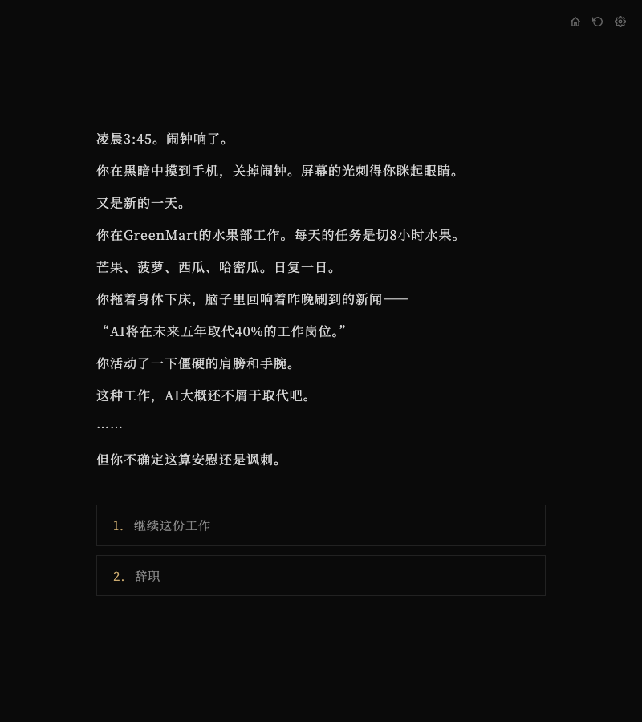
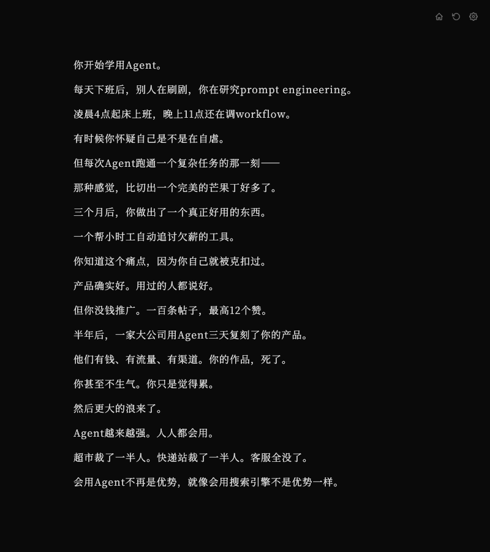
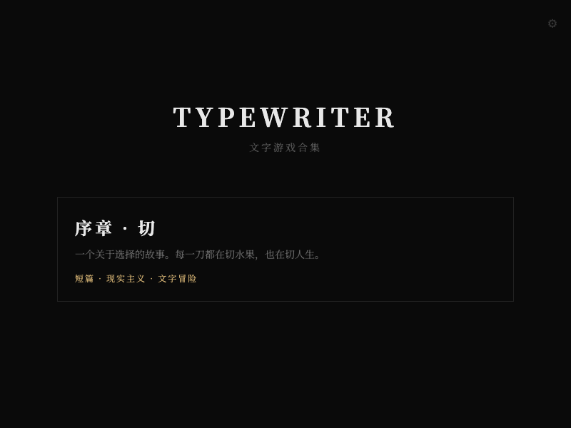

<h1 align="center">
  
</h1>

<p align="center">
  interactive branching fiction with typewriter rendering
</p>

<p align="center">
  <a href="https://y0-x-0y.github.io/typewriter">
    
  </a>
</p>

---

### The Story

3:45 AM. The alarm goes off.

You work the fruit section at GreenMart. Eight hours of cutting mangoes, pineapples, watermelons. Every day the same. You drag yourself out of bed, last night's headline still echoing — *"AI will replace 40% of jobs in the next five years."*

This kind of work? AI probably wouldn't bother.

You're not sure if that's comforting or insulting.

Then a choice appears. Stay, or quit. Each path branches into a different life — learning to code, burning through savings, calling your parents for help, or grinding until something breaks. There are no right answers. Only consequences.

---

### Branching Choices

<p align="center">
  
</p>

Every decision point offers two or more paths. The story tracks your choices and leads to different endings.

---

### Multiple Endings

<p align="center">
  
</p>

Each playthrough reveals one thread of the story. Replay to find them all.

```
Endings:
  Dull Blade          — you stayed, and the blade wore down
  Desert of Plenty    — you built something, but lost something else
  The Cage            — you went home, and the door closed behind you
  ...
```

---

### Engine

<p align="center">
  
</p>

- Typewriter text rendering with natural character-by-character pacing
- Branching narrative with tracked story tree
- Bilingual — Chinese and English, switchable mid-game
- Auto-save and resume
- Dark minimal UI, serif typography
- Single HTML file — no build step, no dependencies

### Make Your Own

Copy `index.html` to a new folder. Edit the `GAME_STORY` object. Open in browser. Done.

See `template/` for a documented starting point.
